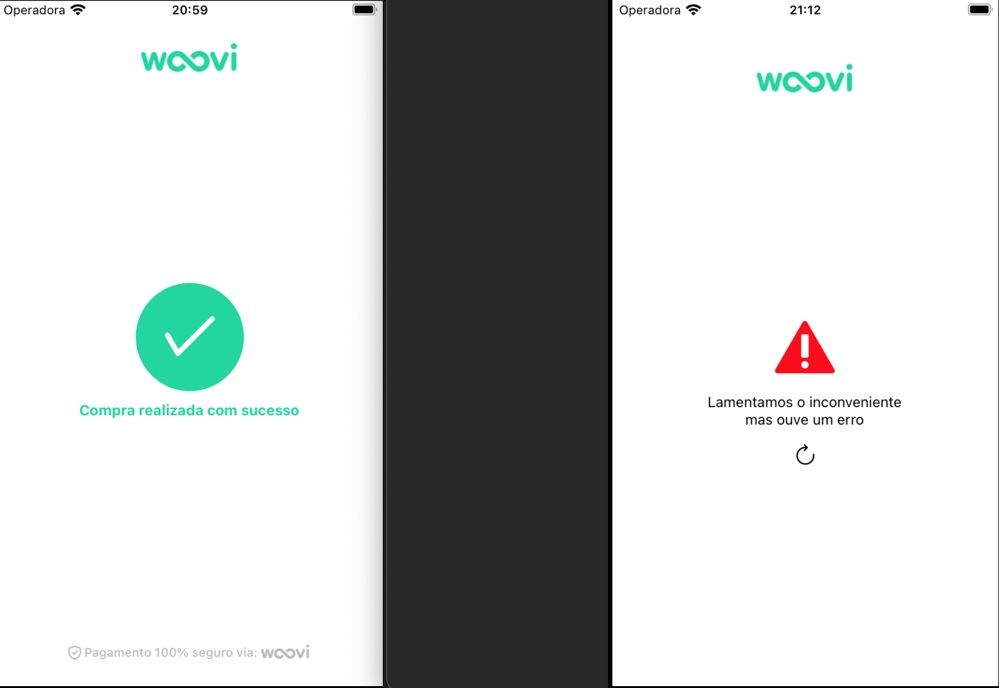

Nota 1: É importante destacar que as rotas específicas do "User" não serão totalmente utilizadas, mas estarão disponíveis como exemplos.

Nota 2: Tipos do GraphQL podem conter informações desnecessárias usadas como exemplos ou para documentação.

Nota 3: Eu nunca fiz uma rota de pagamento, nem sei como deve ser feito, por isso essa rota é mais como um exemplo.

Nota 4: Não consigo entender, o model "Tax" foi bem feito e funcionava, agora ele está dando um bug que está refletindo no frontend, não consigo resposta da query. Pelo que parece, foi um erro de importação.

Nota 5: O cashback padrão será de 1%, a taxa será de 32,788%.

Nota 6: Os tipos do backend e o schema.graphql são gerados automaticamente pela função automaticGenerators.

Para iniciar o projeto, é necessário que um servidor Redis esteja ativo, por minha vez eu indico o [docker](https://www.docker.com/) para isso.

Iniciar servidor Redis:

```bash
 docker run -d -p 6379:6379 --name redis_container redis
```

Para iniciar o backend:

1 - Alterar o env do MONGODB_CONNECT para sua URL de conexão do MongoDB.
2 - Verifique se a porta 4005 está livre ou altere o env PORT.
3 - Se você seguiu o exemplo acima, não é necessário alterar o env, mas se não baixou o Docker e criou a rota na porta específica do exemplo, é necessário alterar o env da porta REDIS_PORT e o REDISHOST.

Para iniciar o servidor:

```bash
 cd backend && npm start
 or
 cd backend && yarn start
```

Para iniciar o frontend e necessario que o servidor backend esteja ativo.

```bash
npm run ios-relay
npm run android-relay
or
yarn ios-relay
yarn android-relay
```

Se você deseja testar o QR code, precisa alterar o env do appID (APP_ID), adicionando o ID do Woovi.

Para um teste rápido, eu instalei o "concurrently". Com ele, os comandos para ativar o backend e o frontend se tornam desnecessários, mas ainda é necessário o servidor Redis. Para ativar tudo de uma vez, vá na raiz e execute este comando:

```bash
npm run ios
npm run android
or
yarn ios
yarn android
```

Essas são as telas principais:


Telas extras:

